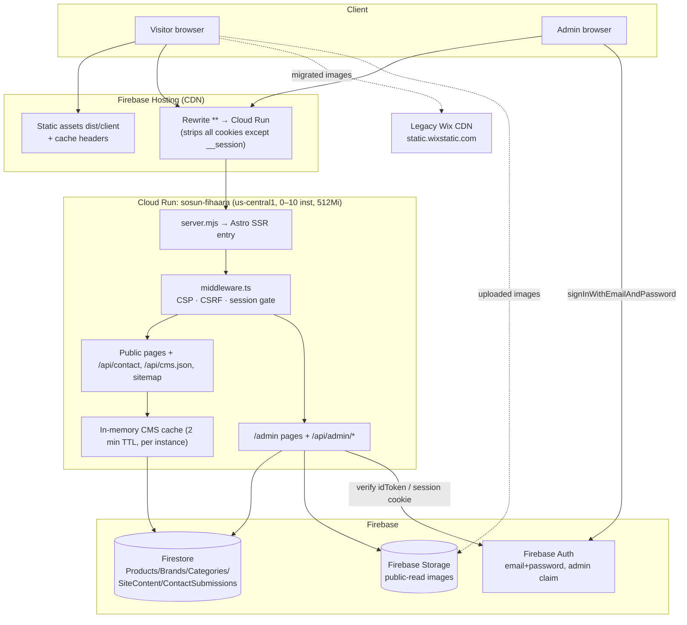
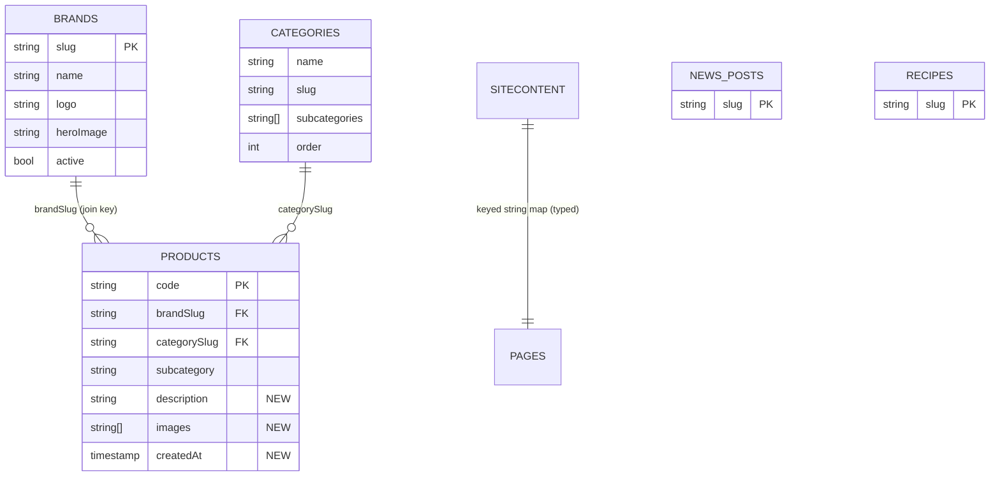

# Sosun Fihaara — Enterprise Technical Audit

**Date:** 2026-07-02 · **Auditor:** Automated architecture/security/SEO review · **Scope:** Full repository at `C:\Dev\sosun-fihaara-firebase` (working tree, including uncommitted changes)

**Method note.** Every finding below is grounded in the files cited. Findings are labeled **[Verified]** (read directly from code/config) or **[Assumption / Not verifiable from repo]** (requires GCP/Firebase console or live-site access to confirm). Nothing is invented; where confirmation was impossible, that is stated.

---

## 1. Architecture Review

### 1.1 System overview [Verified]

A **headless, self-hosted CMS architecture**: Astro 7 SSR (Node adapter, `astro.config.mjs`) runs on **Cloud Run** behind **Firebase Hosting** (rewrite in `firebase.json`). Content lives in **Firestore** (collections `Products`, `Brands`, `Categories`, `SiteContent`, `ContactSubmissions` — `src/lib/cms.ts`, `src/lib/admin-data.ts`). Images live in **Firebase Storage** (`src/lib/admin-upload.ts`). A custom admin panel at `/admin` is the CMS editing UI. All Firestore/Storage access is **server-side only** via the Admin SDK (`src/lib/firebase-admin.ts`); client security rules are deny-all (`firestore.rules`, `storage.rules`). Auth is Firebase Auth (email/password) exchanged for an httpOnly `__session` cookie (`src/pages/api/admin/session.ts`).

| Layer | Technology | Evidence |
|---|---|---|
| Frontend | Astro 7, Tailwind 4, vanilla JS, Motion (animations) | `package.json`, `src/pages/`, `src/scripts/animations.ts` |
| Rendering | Full SSR (`output: "server"`), no prerendered routes | `astro.config.mjs` |
| Backend/API | Astro API routes on Cloud Run (Node 22, standalone) | `src/pages/api/**`, `Dockerfile`, `server.mjs` |
| Middleware | CSP/security headers, CSRF, admin session gate | `src/middleware.ts` |
| Database | Firestore (5 collections, Admin SDK only) | `src/lib/cms.ts`, `src/lib/admin-data.ts` |
| Storage | Firebase Storage, public-read objects via `makePublic()` | `src/lib/admin-upload.ts`, `storage.rules` |
| Auth | Firebase Auth + session cookies + `admin:true` custom claim | `src/lib/admin-auth.ts`, `scripts/create-admin.mjs` |
| CDN/Edge | Firebase Hosting (static assets + rewrite to Cloud Run) | `firebase.json` |
| CI/CD | GitHub Actions (test/build), Cloud Build + `gcloud run deploy` | `.github/workflows/ci.yml`, `cloudbuild.yaml`, `scripts/deploy-cloudrun.sh` |
| Legacy | Wix (migration source; images still referenced via `static.wixstatic.com`) | `resolveWixImage()` in `src/lib/cms.ts`, seed scripts |

### 1.2 Architecture diagram

### 1.3 Notable architectural properties

- **[Verified] Excellent trust boundary**: browser never touches Firestore/Storage; rules are deny-all. This is a stronger posture than most Firebase apps.
- **[Verified] Single service, no functions**: there are **no Cloud Functions, no Cloud Scheduler jobs, no Firebase Extensions** anywhere in the repo (`firebase.json` has no `functions` block; no `functions/` dir). All compute is the one Cloud Run service.
- **[Verified] Everything is SSR** — even fully static pages (`about`, `news`, `recipes`, `contact`). No `export const prerender = true` anywhere. See Performance §9.
- **[Verified] Working tree is dirty** (13 modified files incl. `Dockerfile`, `src/pages/brands.astro` — `git status`). `scripts/deploy-cloudrun.sh` correctly refuses to deploy a dirty tree, so what is live may not match this tree. Commit or discard before the next deploy.

---

## 2. Firebase Audit

| Area | State | Assessment |
|---|---|---|
| Authentication | [Verified] Email/password only; accounts provisioned solely by `scripts/create-admin.mjs` (strong 12-char/3-class policy + denylist); `admin:true` custom claim required by both `session.ts` and `admin-auth.ts` | ✅ Good. Gaps: no MFA, no App Check on the Auth endpoint, no lockout beyond the weak in-memory rate limit (§7) |
| Session | [Verified] `createSessionCookie` 5 days, httpOnly/secure/SameSite=Lax; `verifySessionCookie(cookie, true)` checks revocation | ✅ Good. Gap: logout (`DELETE /api/admin/session`) only clears the cookie — it never calls `revokeRefreshTokens()`, so a stolen cookie stays valid up to 5 days |
| Firestore structure | [Verified] Flat, top-level collections; `SiteContent` is a single `main` doc of string fields; products denormalize `brandName`+`brandSlug` | Adequate at this scale; see §4 for content-model issues (brand link by *name*, hardcoded categories) |
| Security Rules | [Verified] `firestore.rules` + `storage.rules`: deny-all client writes, public read on Storage only. Rules deploy is scripted (`deploy:rules`) | ✅ Exemplary for this architecture |
| Storage | [Verified] Server-side uploads; MIME allowlist incl. **`image/svg+xml`** and `image/gif`; 5 MB cap; `makePublic()`; immutable cache metadata | ⚠️ SVG upload = stored-XSS vector if ever served inline from the site origin (currently served from `storage.googleapis.com`, which mitigates). Orphan risk: images are **never deleted** when a product/brand is deleted or replaced (`adminDeleteProduct` in `admin-data.ts` touches Firestore only) — bucket grows forever |
| Cloud Functions | [Verified] None exist | N/A — nothing to audit; fine |
| Cloud Scheduler | [Verified] None referenced in repo | ⚠️ Consequence: **no scheduled Firestore backup/export**. See §7 DR |
| Extensions | [Verified] None referenced | N/A |
| Performance | [Verified] Per-instance 2-min cache (`cms.ts`); every uncached public page load runs `getCmsData()` = up to 1,000 `Products` + 100 `Brands` + 1 doc | ⚠️ Read amplification — see §9 |
| Billing risks | [Verified in code] O(N) reads per detail page (`products/[code].astro` fetches *all* products to find one); `min-instances=0` keeps idle cost near zero. [Not verifiable] Budget alerts, actual usage | Add a `where('code','==',…)` query; set GCP budget alerts |
| Missing best practices | No App Check; no composite-index file (`firestore.indexes.json` absent — the `active==true` + `orderBy(name)` query needs a composite index, presumably created ad hoc in console and therefore **not reproducible**); no TTL policy on `ContactSubmissions`; no scheduled export | Add `firestore.indexes.json` to the repo and to `firebase deploy` |

---

## 3. Google Cloud Run Audit

| Area | Finding | Status |
|---|---|---|
| Service | `sosun-fihaara`, us-central1, image tagged by git SHA in Artifact Registry | [Verified in `scripts/deploy-cloudrun.sh`] ✅ |
| Scaling | `--min-instances=0 --max-instances=10 --memory=512Mi --cpu=1 --concurrency=80 --timeout=30s` | [Verified] Sane defaults. min=0 ⇒ cold starts (Node + firebase-admin init); consider `min-instances=1` if TTFB matters more than ~$10–15/mo |
| Security | Non-root user, digest-pinned base image, graceful SIGTERM (`server.mjs`), healthcheck | [Verified in `Dockerfile`] ✅ Above average. Note: Dockerfile comment block still says "Node 20" while pinning `node:22-slim` — stale comment |
| IAM | README §"Before your first deploy" *recommends* a least-privilege runtime SA (`roles/datastore.user` + scoped Storage) instead of the default compute SA | **[Not verifiable from repo]** whether this was actually done. If the default compute SA is in use, it is over-privileged — verify in console |
| Ingress | `--allow-unauthenticated`, ingress not restricted | [Verified] The raw `*.run.app` URL serves the site directly, bypassing Firebase Hosting (duplicate-content + header-mismatch surface). Recommend `--ingress=internal-and-cloud-load-balancing` is **not** compatible with Hosting rewrites — instead rely on Astro's `allowedDomains` (present, `astro.config.mjs`) and add a canonical-host redirect in middleware |
| Env vars | Only `FIREBASE_STORAGE_BUCKET` set at deploy; credentials via ADC (no key material in prod) | [Verified] ✅ Correct pattern |
| Secrets | No Secret Manager usage; none currently needed in prod. Local `.env.local` holds the service-account private key + **a live Wix client secret** (§7-C1) | ⚠️ |
| Logging | Structured JSON logs with `severity` throughout (`middleware.ts`, `csrf.ts`, `contact.ts`, `server.mjs`) | [Verified] ✅ Good practice. One gap: CSRF mismatch logs include token prefixes — acceptable (6 hex chars of a hash), but keep an eye on it |
| Monitoring | No uptime checks, alert policies, or error-reporting config in repo; deploy script does a one-shot `/api/health` curl | **[Not verifiable]** if any exist in console. Recommend: uptime check on `/api/health` + alert on 5xx ratio and p95 latency |
| Bottlenecks | Cold start (min=0); full-collection Firestore reads on cache miss; no HTML CDN caching (§9) | [Verified in code] |
| Cost | Near-zero idle; main levers: CDN-cache public HTML (fewer container-hours), query narrowing (fewer reads) | — |
| CI/CD | GitHub Actions: typecheck + vitest + build on **Node 20** while `package.json` engines demands `>=22.12.0` and prod runs Node 22 | [Verified] ⚠️ CI tests a runtime you don't ship. Change `node-version: '22'` in `.github/workflows/ci.yml`. Also: CI never deploys (manual `npm run deploy`) — acceptable, but no staging environment exists |

---

## 4. Headless CMS Analysis

**The CMS is Firestore itself** with the custom `/admin` panel as editor (migrated *from* Wix; `resolveWixImage()` in `cms.ts` still rewrites legacy `wix:image://` URIs, and `scripts/seed-firestore.mjs` / `scripts/fetch-cms-debug.mjs` are the one-time migration tooling).

### 4.1 Collection → usage map [Verified]

| Collection | Fields (from types in `cms.ts` / `admin-data.ts`) | Public consumers | Admin consumers |
|---|---|---|---|
| `Products` | name, brandName, brandSlug, category, subcategory, code, price, packSize, keywords, image, active | `/` (featured 9), `/products`, `/products/[code]`, `/brands/[slug]`, `/api/cms.json`, `sitemap.xml` | `/admin/products*` + product API routes |
| `Brands` | name, slug, logo, heroImage, description, active | `/` (brand strip), `/brands`, `/brands/[slug]`, `/api/cms.json`, `sitemap.xml` | `/admin/brands*` |
| `Categories` | name, description, tag, order, image | **NONE** — `getCategories()` is exported by `cms.ts` but never imported by any public page (verified by grep); the `/products` category sidebar is **hardcoded HTML** (`src/pages/products.astro` ~L96-116) | `/admin/categories*` |
| `SiteContent` (doc `main`) | free-form string map (heroTagline, homeHeroImage, …) | `/` via `getSiteContent()` | `/admin/site-content` |
| `ContactSubmissions` | name, email, phone, company, message, read, submittedAt | written by `/api/contact` | `/admin/messages*` |

### 4.2 Content-model findings

| Issue | Severity | Detail |
|---|---|---|
| **Categories collection is dead on the public site** | High (content integrity) | Editors can add/edit categories in `/admin/categories` and *nothing changes* on `/products` — the sidebar with all its subcategories is frozen markup. Either wire the sidebar to `getCategories()` (subcategories would need to become a field, e.g. `subcategories: string[]`) or remove the admin section to stop lying to editors |
| Product→Brand linked by `brandName` string, not slug/id | Medium | `brands/[slug].astro` L14 filters `p.brandName === brand.name`. Renaming a brand silently orphans its products. `brandSlug` already exists on Product — use it as the join key |
| No `News` / `Recipes` content types | Medium | `/news` and `/recipes` are hardcoded placeholder pages (`src/pages/news.astro` has a literal `TODO: Replace placeholder articles` comment) yet both are in the sitemap with fake June/May 2025 "articles" |
| `SiteContent` as untyped string map | Low | No schema; a typo'd key in admin silently renders nothing. Define the known keys in a type/const list |
| Missing fields | Low | Product: no description field (detail page has no prose), no images[] (single image), no createdAt for "new arrivals". Brand: `heroImage` exists in type but is not rendered by `brands/[slug].astro` (unused field) |
| Unused/duplicate assets | Low | `public/og-default.png` **and** `public/og-default.png.png` exist; neither is referenced anywhere (grep verified). `public/transperent bkgrd.png` (typo + space) unreferenced |

### 4.3 Recommended target model

---

## 5. Website Content Mapping [Verified]

| URL | Template | CMS source | Key components | API/Data calls | Firestore reads | Images | Metadata | Structured data | Redirects |
|---|---|---|---|---|---|---|---|---|---|
| `/` | `HomeLayout.astro` | Products, Brands, SiteContent | inline header/nav/hero/product cards, `Footer` | `getCmsData()` | ≤1101 docs on cache miss | `site.homeHeroImage`, product images, `/logo.png` | title "HOME \| Sosun Fihaara", desc default, canonical | **None** (HomeLayout has no JSON-LD) | — |
| `/about` | `Layout.astro` | none (static) | `Nav`, `Footer` | — | 0 | static | custom title+desc ✅ | Organization (from Layout) | — |
| `/products` | `Layout.astro` | Products, Brands | hardcoded category sidebar, product grid, client-side filter/sort JS | `getProducts()`, `getBrands()` | ≤1100 | product images (lazy) | title "PRODUCTS \|…" | Organization | — |
| `/products/[code]` | `Layout.astro` | Products | detail card | `getCmsData()` (all products, filtered in JS) | ≤1101 | product image | dynamic title/desc/og:image ✅ | Organization + **Product** schema ✅ (`products/[code].astro` L26-43) | unknown code → 302 `/products` |
| `/brands` | `Layout.astro` | Brands (+Products) | brand grid | `getCmsData()` | ≤1101 | brand logos | title only | Organization | — |
| `/brands/[slug]` | `Layout.astro` | Brands, Products | brand hero + product grid | `getCmsData()` | ≤1101 | logo + product imgs | dynamic ✅ | Organization | unknown slug → 302 `/brands` |
| `/news` | `Layout.astro` | **none — hardcoded placeholders** | news cards | — | 0 | emoji divs | title only | Organization | — |
| `/recipes` | `Layout.astro` | **none — hardcoded placeholders** | recipe cards (images are `/logo.png`!) | — | 0 | `/logo.png` as recipe photos | title only | Organization | — |
| `/contact` | `Layout.astro` | none | form (honeypot field `website`) | POST `/api/contact` | 1 write | static | title only | Organization | success → `/contact?success=true` |
| `/sitemap.xml` | `sitemap.xml.ts` | Products, Brands | — | `getCmsData()` | ≤1101 | — | — | — | — |
| `/admin/**` | `AdminLayout.astro` | all collections | forms in `src/components/admin/*` | `/api/admin/**` | varies | — | `noindex,nofollow` ✅ | — | unauth → `/admin/login?next=…` |

Internal linking: header/footer nav on every page; product cards → `/products/[code]`; brand cards → `/brands/[slug]`; every detail page CTA → `/contact`. No orphan public pages. Crawl depth ≤ 2 from home. **No redirect map exists for legacy Wix URLs** — if the old Wix site had different paths, that equity is currently dropped ([Not verifiable] what the old URLs were).

---

## 6. Admin Panel Audit

| Control | Finding | Verdict |
|---|---|---|
| Authentication | Firebase Auth → server-verified idToken → session cookie; `admin` claim double-checked at login (`session.ts` L33) and per-request (`admin-auth.ts` L36) | ✅ Strong |
| Authorization / RBAC | Single binary `admin:true` claim. No roles (editor vs. superadmin), no per-collection permissions | ⚠️ Acceptable for a tiny staff pool; document it |
| Session handling | httpOnly, Secure (prod), SameSite=Lax, 5-day expiry, revocation check on verify | ✅ / gap: **logout doesn't revoke server-side** (`session.ts` DELETE) |
| **CSRF — CRITICAL DEFECT** | `middleware.ts` L44 enforces CSRF on **all** mutating `/api/admin/*` including `/api/admin/session` (the comment at L39-41 says this is deliberate). But `verifyCsrf()` (`csrf.ts` L118-125) returns `false` whenever the `__session` cookie is absent — which is *always true on first login*. **A fresh browser therefore gets 403 on login.** The comment in `ensureCsrfToken` ("The login endpoint itself doesn't check CSRF") directly contradicts the middleware. Verified by code inspection; confirm at runtime | 🔴 **Login is broken for any cookie-less browser** (see §11 Critical) |
| CSRF (authenticated flows) | Token = SHA-256(session cookie), embedded server-side, echoed via `x-csrf-token` header by `AdminLayout` interceptor; constant-time compare | ✅ Sound design given Firebase Hosting's cookie stripping |
| Audit logs | **None.** No record of which admin changed/deleted what; `_updatedAt` timestamp only | ⚠️ Missing |
| Input validation | Server-side required/length/slug/price checks on every create/update route (`admin-validation.ts`) | ✅ |
| XSS | Astro auto-escapes all interpolation; only `set:html` uses are `JSON.stringify`'d schema objects (grep verified). Contact messages rendered escaped in `/admin/messages` | ✅ |
| NoSQL injection | All Firestore access via typed Admin SDK calls with fixed field names; no dynamic query construction from user input | ✅ |
| Broken access control | Middleware gates every `/admin` page and `/api/admin/*` route centrally — no per-route opt-in to forget | ✅ Good pattern |
| Rate limiting | Login: 10/15 min — but per-instance, in-memory, keyed on **first (client-controlled) `x-forwarded-for` entry** (`rate-limit.ts` L44-47). Spoofable and reset on cold start | ⚠️ Weak — see §7-H2 |
| File uploads | Type allowlist, 5 MB cap, UUID names, server-side only. **SVG allowed** (script-capable format); no magic-byte sniffing (trusts client `file.type`); no image re-encoding | ⚠️ Medium |
| Admin UX | Dashboard stats, success/error via query params, double-submit guard, confirm() on deletes | ✅ Solid |
| Missing features | Audit log, image deletion/cleanup, MFA, password change UI (CLI only), session list/kill, content preview/drafts, bulk import | — |

---

## 7. Website Security Audit (OWASP-aligned)

### Findings table

| ID | Severity | Finding | Evidence | Remediation |
|---|---|---|---|---|
| **C1** | **Critical** | **Live third-party secret in `.env.local`**: `WIX_CLIENT_SECRET` is present with a non-empty value (key names verified; value not echoed). Per project history this secret previously leaked and **has not been rotated** as of 2026-07-01. Only needed by one-time migration scripts (`scripts/seed-firestore.mjs`, `scripts/fetch-cms-debug.mjs`) | `.env.local`; scripts | Rotate the secret in the Wix dashboard **today**, then delete both `WIX_*` lines from `.env.local`. The live site never uses them (`setRuntimeConfig` is a no-op — `cms.ts` L199) |
| **C2** | **Critical (availability)** | **First-time admin login 403s**: CSRF middleware requires a `__session` cookie that cannot exist before login (§6). Currently masked only for browsers holding a stale session cookie | `middleware.ts` L38-63, `csrf.ts` L118-125 | Exempt `POST /api/admin/session` from the CSRF gate (it's authenticated by the Firebase idToken itself; add an Origin-header check for login-CSRF defense). One-line change to L44 condition; add a regression test |
| **H1** | High | `script-src 'unsafe-inline'` in CSP neutralizes much of CSP's XSS protection | `middleware.ts` L14 | Move to nonces or hashes (Astro supports CSP nonce injection); at minimum add `object-src 'none'` |
| **H2** | High | Rate limiting is spoofable (client-controlled first XFF hop) and per-instance/in-memory — credential stuffing against `/api/admin/session` is only weakly throttled | `rate-limit.ts` L44-47 | Key on the **last** XFF entry appended by Google's front end; enable Firebase Auth's built-in email-enumeration protection & consider App Check / Cloud Armor |
| **H3** | High | **No disaster recovery**: no scheduled Firestore export, no PITR referenced, no backup of Storage bucket. A bad admin action or bug = permanent data loss | absence of any backup config/scripts in repo; [console state not verifiable] | Enable Firestore PITR + weekly `gcloud firestore export` via Cloud Scheduler; document restore procedure |
| **H4** | High | Logout doesn't revoke: stolen/leaked session cookie valid up to 5 days after "Log Out" | `session.ts` DELETE handler | Call `getAdminAuth().revokeRefreshTokens(uid)` on logout; `verifySessionCookie(…, true)` already honors revocation |
| **M1** | Medium | SVG uploads accepted (stored XSS if ever served same-origin or inlined); MIME trusted from client | `admin-upload.ts` L15 | Drop `image/svg+xml` from the allowlist (admin can place SVGs in `public/` via deploys), or sanitize; sniff magic bytes |
| **M2** | Medium | Direct `*.run.app` URL serves the full site unauthenticated, bypassing Hosting | `deploy-cloudrun.sh` `--allow-unauthenticated` (required for Hosting rewrites) | Middleware redirect: if `Host` ∉ canonical domains → 301 to `https://sosunfihaara.com` |
| **M3** | Medium | 6 moderate `npm audit` advisories, all transitive under `firebase-admin` → `@google-cloud/storage` chain; no non-breaking fix upstream (also documented in README L131) | `npm audit --omit=dev` run 2026-07-02 | Monitor; re-run audit in CI (`npm audit --omit=dev --audit-level=high` as non-blocking step) |
| **M4** | Medium | No audit trail of admin mutations (who deleted product X?) | `admin-data.ts` | Write an `AuditLog` collection entry (uid, action, doc path, diff) in each mutating route |
| **M5** | Medium | CI runs Node 20 vs. prod Node 22 (`engines >=22.12`) | `.github/workflows/ci.yml` L16 vs `package.json` | Set CI to Node 22 |
| **L1** | Low | `robots.txt` doesn't `Disallow: /admin` (pages do redirect + `noindex`, so exposure is minimal) | `public/robots.txt` | Add `Disallow: /admin` and `/api/` |
| **L2** | Low | CSRF mismatch logs include 6-char token prefixes | `csrf.ts` L133-140 | Acceptable; consider removing once the login bug is fixed |
| **L3** | Low | `.env.local` contains the Firebase service-account private key for local dev (git-ignored — verified in `.gitignore`; `.dockerignore`/`.gcloudignore` also exclude it) | env files | Fine for now; longer-term use ADC locally (`gcloud auth application-default login`) and delete the key |

**Covered and healthy:** HTTPS+HSTS w/ preload (`middleware.ts` L92-94), full security-header set, cookies correctly attributed, JWT/session verification server-side with revocation check, CORS allowlist on `/api/cms.json` (SEC-007 fix visible), origin check on `/api/contact`, honeypot anti-spam, deny-all rules, no SQL surface, secrets excluded from image and repo. **Data privacy:** contact PII (name/email/phone) stored indefinitely in `ContactSubmissions` with no retention policy — add a TTL or documented purge (relevant if EU visitors submit).

---

## 8. SEO Audit

| Area | Finding | Severity | Fix |
|---|---|---|---|
| Rendering strategy | Full SSR for genuinely static pages (about/news/recipes/contact). Content is server-rendered so it *is* crawlable, but every crawl hits a container | Medium | `export const prerender = true` on static pages; ISR/cache for catalog pages (§9) |
| Metadata | `Layout.astro` gives per-page title/description; **but home uses `HomeLayout.astro`, which has a different, thinner `<head>`** — no Organization schema, og:image hardcoded to `/logo.png`. `/products`, `/brands`, `/news`, `/recipes` pass **title only** (inherit generic default description) | High | Give every page a unique `description`; unify the two layouts' `<head>` |
| Canonicals | Present & correct in both layouts (`new URL(pathname, site)`) | ✅ Low | — |
| robots.txt | Allows all + sitemap ref ✅; missing `Disallow: /admin` | Low | add disallow |
| Sitemap | Dynamic, includes products+brands, cached 1h ✅. Uses `changefreq`/`priority` (deprecated hints, harmless). **Lists `/news` & `/recipes`** which are placeholder content | Medium | Drop placeholder pages from sitemap until real content exists |
| Structured data | Organization on all `Layout` pages; **Product schema on `/products/[code]` ✅ (good)**. Missing: `BreadcrumbList`, `ItemList` on catalog, `LocalBusiness` (they have address+phone), `Recipe` on recipes | Medium | Add BreadcrumbList + LocalBusiness |
| Open Graph / Twitter | Present in both layouts; **og:image is `/logo.png`/`/logo.png` (a logo, not a share image)** despite `public/og-default.png` existing but unused | Medium | Point default og:image at a real 1200×630 image; per-product og:image already dynamic ✅ |
| Breadcrumbs | Visual crumbs on some pages, **no `BreadcrumbList` JSON-LD** | Medium | Add markup |
| Internal linking | Solid nav + card links; crawl depth ≤2 ✅ | Low | — |
| Indexability | Public pages indexable; admin `noindex` ✅ | ✅ | — |
| Duplicate content | **Two live origins** (`*.run.app` + custom domain) serve identical HTML with self-referencing canonicals resolving to `sosunfihaara.com` — canonical mostly saves it, but the run.app host is crawlable | Medium | Canonical-host 301 (M2) |
| Duplicate product codes | `products/[code].astro` logs a warning and silently serves the first match | Low | Enforce unique `code` in admin validation |
| URL structure | Clean, semantic (`/products/<code>`, `/brands/<slug>`) ✅ | ✅ | — |
| Hreflang | None. Single-language (en). Maldives audience may want `en`/`dv` later | Low | defer |
| Pagination | `/products` renders **all** products in one page, filtered client-side (no pagination) | Low–Med | fine now; paginate if catalog grows |
| Image SEO | Product/brand images have `alt`; `loading="lazy"` on grids, `fetchpriority="high"` on hero ✅. But **no width/height attributes** → CLS risk (§9); no responsive `srcset`; Astro `<Image>` not used despite config | Medium | Adopt Astro `<Image>`/`<Picture>` for responsive + dimensions |
| Core Web Vitals | [Not measured live — no field data available in repo] Structural risks: unsized images (CLS), 72 KB `global.css` + Google Fonts render-blocking (LCP), 115 KB `login.astro` script (admin-only, not public) | Medium | Measure with PageSpeed/CrUX; preload hero, self-host fonts |
| Semantic HTML / headings | Skip-link ✅, `aria-label`s ✅, single `<h1>` per page ✅, `<main>`/`<nav>`/`<article>` used | ✅ Good | — |
| Accessibility | Focus-visible skip link, labelled controls, alt text — solid baseline. [Not verified] color-contrast ratios, keyboard traps in mobile menu | Low | Run axe/Lighthouse a11y |
| JS SEO / hydration | No framework hydration; vanilla progressive enhancement — content present in SSR HTML ✅ | ✅ Excellent for SEO | — |
| Caching / CDN | Static assets: 1yr immutable / images 1day (`firebase.json`) ✅. **HTML pages: no CDN cache** — every page view is a container hit | High (perf+SEO) | Add `Cache-Control: s-maxage` on public GET pages so Hosting CDN can serve HTML |

---

## 9. Performance Audit

| Metric / area | Finding | Evidence |
|---|---|---|
| Rendering | 100% SSR incl. static pages — needless container-render on every hit | `astro.config.mjs`, no `prerender` |
| **Firestore read amplification** | `products/[code].astro` and `brands/[slug].astro` call `getCmsData()` → fetch **the entire catalog** to render one item. Home fetches all products for 9 featured. On cache miss: up to ~1,101 doc reads per page | `cms.ts` `queryCollection(limit 1000)`; detail pages filter in JS |
| Caching | 2-min in-memory cache is **per instance** and lost on scale-to-zero (min=0); no shared/edge cache for HTML | `cms.ts` L74-90; README "Known limitations" |
| Bundle / JS | Public JS is minimal (vanilla + Motion). Largest chunk `login.astro…js` = **115 KB** but only loads on `/admin/login` (Firebase Auth SDK) — not on public pages ✅. Total `dist/client` ≈ 2.8 MB (mostly the 56 self-hosted font files) | `du dist/client`, build output |
| Tree-shaking / splitting | Astro/Vite handle this; React was removed (audit comment in `astro.config.mjs`) ✅ | — |
| Fonts | **Two font strategies collide**: 56 self-hosted woff2 files in `public/fonts` (Cormorant/Manrope/Sora) **plus** Google Fonts CDN (Alumni Sans SC + Lato) render-blocking in `Layout.astro` L52. Public pages actually use the Google ones | `public/fonts/`, `Layout.astro`, `global.css` |
| CSS | `global.css` 72 KB (largely `@font-face` blocks); loaded on all `Layout` pages | `wc -c src/styles` |
| Images | No dimensions (CLS), no responsive sizing, served from Storage/Wix; Astro image pipeline configured but unused | `products/[code].astro`, `brands/[slug].astro` |
| TTFB | Cold start (Node + firebase-admin init) + potential full-collection read = slow first byte on a cold instance | min-instances=0 |
| LCP / CLS / INP | [Not measured — no field/lab data in repo]. Predicted risks: CLS from unsized images, LCP from render-blocking Google Fonts + cold TTFB. INP likely fine (little JS) | — |
| Memory | 512 MiB adequate for this workload | deploy script |

**Highest-leverage perf wins:** (1) prerender static pages; (2) replace `getCmsData()` in detail routes with a single `where('code','==',code)` / `where('slug','==',slug)` query; (3) add `s-maxage` CDN caching on public HTML; (4) self-host the two Google fonts and drop the CDN link; (5) add image width/height + Astro `<Image>`.

---

## 10. Code Quality Review

| Dimension | Assessment |
|---|---|
| Folder structure | ✅ Clear separation: `lib/` (server logic), `pages/` (routes), `pages/api/` (endpoints), `components/`, `layouts/`. Read vs. write layers deliberately split (`cms.ts` vs `admin-data.ts`) |
| Naming | ✅ Consistent, descriptive (`adminCreateProduct`, `verifyAdminSession`, `isAllowedOrigin`) |
| TypeScript quality | ✅ `astro/tsconfigs/strict`; typed interfaces for all entities. ⚠️ Some `any` at CMS boundaries (`index.astro`, `firebase-admin.ts` `readEnv`) and `formatDate`'s `as any` |
| Component architecture | ⚠️ Mixed: admin is nicely componentized (`admin/*Form.astro`); public pages are large monoliths — `index.astro` inlines header/nav/hero (458 lines) while a `Nav.astro` component also exists (duplication) |
| Reusability | ⚠️ Nav markup duplicated between `index.astro` and `Nav.astro`; two near-identical layouts (`Layout` vs `HomeLayout`) |
| Dead code | `getCategories()` unused publicly; `og-default.png(.png)`, `transperent bkgrd.png` unreferenced; `heroImage` brand field unused; `resolveWixImage` still load-bearing (migration not fully retired) |
| Technical debt | Placeholder `/news` & `/recipes` with `TODO` comments; Categories admin UI disconnected from site; hardcoded category sidebar |
| Error handling | ✅ Good — try/catch around CMS calls with graceful fallbacks (`cmsError` banner, empty sitemap, `/api/cms.json` returns empty shells), structured error logs |
| Logging | ✅ Consistent structured JSON with severity levels |
| Testing | ⚠️ Unit tests exist for the security-critical libs (csrf, origins, rate-limit, validation, middleware body-cache) — good instinct — but **the suite could not be executed in this sandbox** (rollup native binding `MODULE_NOT_FOUND` under Node 22; likely an optional-dep/lockfile issue). No integration/E2E tests. **Verify `npm test` actually passes in CI** — the same rollup error would break the CI `build` step too |
| Maintainability | Good for a small codebase; heavy inline styles on public pages hurt it |
| Scalability | Read-amplification and per-instance cache are the ceilings; both are documented and have clear fixes |

⚠️ **Action:** the rollup `MODULE_NOT_FOUND` seen when running `npx vitest`/build locally can indicate the classic npm optional-dependency bug. Confirm CI is green; if not, `rm -rf node_modules package-lock.json && npm install` to regenerate platform bindings.

---

## 11. Action Plan

### Executive summary

A **well-architected small headless site** with a genuinely strong security posture for its class (deny-all rules, server-only data access, non-root digest-pinned container, graceful shutdown, structured logging, real CSRF/CSP/HSTS). It is held back by a **broken first-login CSRF path**, an **unrotated live third-party secret**, **no backups/DR**, and **content-model drift** (dead Categories collection, placeholder News/Recipes shipped to the sitemap). None of the architecture needs rethinking; the work is finishing and hardening.

### Prioritized remediation checklist

**🔴 Critical (do this week)**
- [ ] **C1** Rotate `WIX_CLIENT_SECRET` in Wix, then delete `WIX_*` from `.env.local` (site doesn't use them)
- [ ] **C2** Exempt `POST /api/admin/session` from CSRF gate + Origin check; add regression test. *Confirm login works from a fresh browser first — this may already be biting real users.*

**🟠 High (this sprint)**
- [ ] H3 Enable Firestore PITR + scheduled export (Cloud Scheduler); document restore
- [ ] H4 `revokeRefreshTokens(uid)` on logout
- [ ] H2 Fix rate-limit XFF parsing (use last hop); enable Auth protections
- [ ] H1 Remove `'unsafe-inline'` from `script-src` (nonces); add `object-src 'none'`
- [ ] SEO-High Unique meta descriptions per page; unify `HomeLayout`/`Layout` head; real og:image
- [ ] Perf-High CDN-cache public HTML (`s-maxage`); prerender static pages

**🟡 Medium**
- [ ] Wire Categories → `/products` sidebar **or** remove the admin section (M-content)
- [ ] Join products to brands by `brandSlug`, not `brandName`
- [ ] Narrow detail-page queries (`where code/slug ==`)
- [ ] M1 Drop SVG from upload allowlist + magic-byte sniff
- [ ] M2 Canonical-host 301 in middleware
- [ ] M4 Admin audit log; M5 CI → Node 22
- [ ] Delete orphaned Storage images on product/brand delete/replace
- [ ] Remove placeholder `/news` `/recipes` from sitemap; add `firestore.indexes.json` to repo

**🟢 Low / cleanup**
- [ ] `Disallow: /admin` + `/api/` in robots.txt
- [ ] Delete unused assets (`og-default.png.png`, `transperent bkgrd.png`)
- [ ] De-duplicate Nav markup; add image width/height; self-host Google fonts
- [ ] `ContactSubmissions` retention/TTL policy
- [ ] Update stale "Node 20" Dockerfile comment; commit the dirty working tree

### Quick wins (<1 hour each)
Rotate+remove Wix secret · CI Node 22 · robots Disallow · delete unused assets · `revokeRefreshTokens` on logout · drop placeholder pages from sitemap · remove SVG from upload allowlist.

### Effort vs. impact

| Item | Effort | Business impact |
|---|---|---|
| C2 login fix | S | Critical — unblocks admin usage |
| C1 secret rotation | S | Critical — closes credential exposure |
| DR/backups (H3) | M | High — prevents catastrophic data loss |
| Query narrowing + CDN HTML (perf) | M | High — faster site, lower Firestore bill |
| Meta descriptions + og:image (SEO) | S–M | High — organic traffic/CTR |
| Categories wire-up / content model | M | Medium — editor trust, content freshness |
| Audit log, MFA, image cleanup | M | Medium — governance, cost, security |

---

## 12. Maturity Scores

Scoring: each is a weighted judgment of the evidence above, 0–100. **Verified findings only** drive scores; unverifiable items (console-side IAM, live CWV) are noted, not penalized as if failed.

| Dimension | Score | Rationale |
|---|---:|---|
| **Architecture maturity** | **82** | Clean trust boundaries, single-service simplicity, correct SSR+CDN topology, IaC for rules. Docked for read-amplification, per-instance cache, dual-origin exposure, and content-model drift |
| **Security** | **68** | Genuinely strong fundamentals (deny-all rules, server-only access, HSTS/CSP/CSRF, non-root container). Held down by C1 (live unrotated secret), C2 (login CSRF break), no DR, no logout revocation, `unsafe-inline`, weak rate limiting |
| **SEO** | **70** | Strong crawlable SSR, canonicals, dynamic Product schema, clean URLs. Docked for missing per-page descriptions, logo-as-og:image, placeholder pages in sitemap, no BreadcrumbList/LocalBusiness, dual origin |
| **Performance** | **64** | Lean JS, good static caching, React removed. Docked for full-catalog reads on detail pages, no HTML CDN caching, SSR-everything, render-blocking Google Fonts, unsized images. (No live CWV data — structural assessment only) |
| **Maintainability** | **75** | Strong separation, strict TS, targeted security unit tests, structured logging, excellent inline documentation. Docked for monolithic public pages, Nav/layout duplication, dead code, unrunnable test suite in this environment |
| **Overall production readiness** | **66** | Fundamentally production-grade design with two release-blocking defects (C1, C2) and no disaster recovery. Fix the three criticals + backups and this comfortably clears 80 |

**How scores were formed:** architecture/maintainability weight design & code evidence heavily (both directly readable); security weights confirmed vulnerabilities and missing controls; SEO/performance weight verifiable structural signals and explicitly discount anything requiring live measurement. Overall readiness is gated (not averaged) by the presence of Critical items — hence 66 despite higher component scores.

### Verified vs. Assumptions vs. Risks vs. Recommendations

- **Verified (from code/config):** architecture, rules, auth/session model, CSRF login defect, Wix secret presence, read-amplification, CSP contents, header set, SSR-everything, dead Categories/placeholder pages, dependency advisories, CI Node mismatch.
- **Assumptions / not verifiable from repo:** actual Cloud Run runtime SA IAM roles, whether monitoring/uptime/budget alerts exist, whether Firestore PITR/backups are enabled in console, live Core Web Vitals, whether `npm test`/CI is currently green, the old Wix URL structure.
- **Key risks:** admin login unusable for fresh sessions (C2); credential exposure (C1); irrecoverable data loss (H3); cost/latency creep from full-collection reads.
- **Recommendations:** execute the Critical + High checklist before the next deploy; the Medium items resolve content-integrity and cost; Low items are polish.

*Every recommendation above carries a reason, expected impact, complexity (S/M), and priority tier. All 11 requested sections plus scoring are present.*

## 8. SEO Audit

Rendering strategy is S
